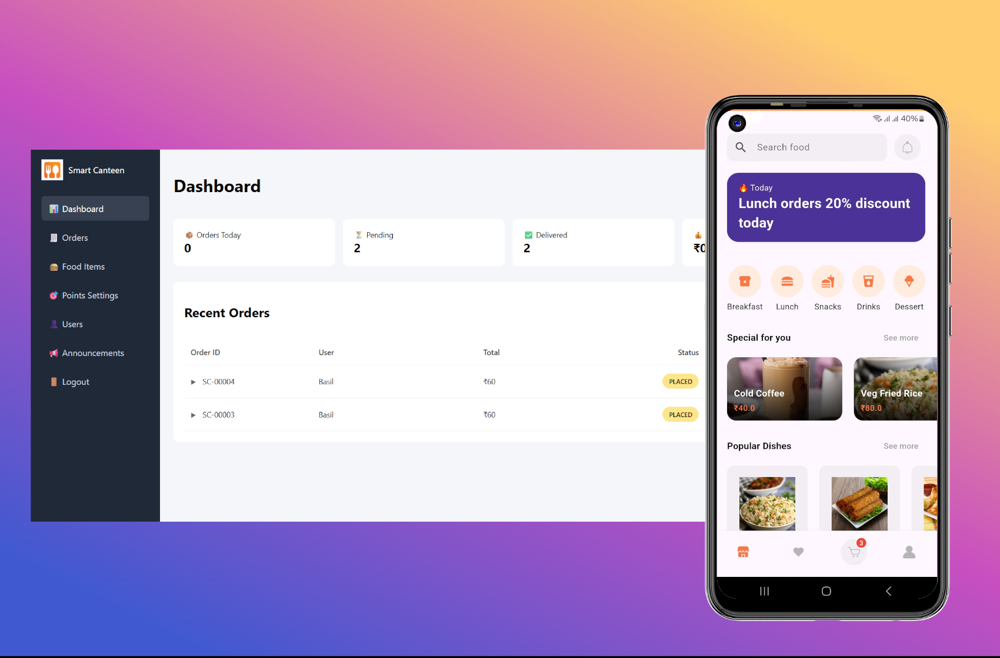

# Smart Canteen
A full-stack smart canteen application.

## Tech Stack
- Flutter (Frontend)
- Node.js + Express (Backend)
- SQLite (Database)
- JWT Authentication
- Google Sign-In
- Image upload with Multer

## Features
- Email & Google authentication
- JWT-based sessions
- Profile avatar upload (email users only)
- Google users use Google-managed avatar
- Secure token revocation
- Flutter mobile app

## Project Structure
- smart_canteen/ → Flutter app
- smart_canteen_server/ → Backend API
### About the Database
This project uses SQLite database. You can access the database by installing SQLite on your system and then open the canteenDB.db file in the server directory using SQLite

## Setup
### Add Secrets
- The project features google authentication, so you will have to create google auth credential on your google console to use them.
- Create a .env file for both frontend and backend by refencing their respective .env.example files in their directory.
- For Newbies: Make sure that you enter the correct local ip address of the system running the server in the frontend .env file. 
### Backend
```bash
npm install
node server.js
```
### Flutter App
```bash
flutter pub get
flutter run
```
### Access Admin panel
```bash
localhost:3000/admin
```
- Default Username: master
- Dafault Password: master123

# 🤝 Contributing

Contributions, suggestions, and feedback are welcome.

1. Fork the repository
2. Create a feature branch
3. Commit your changes
4. Open a Pull Request

# ⭐ Support

If you found this project useful, consider giving it a ⭐ on GitHub!
